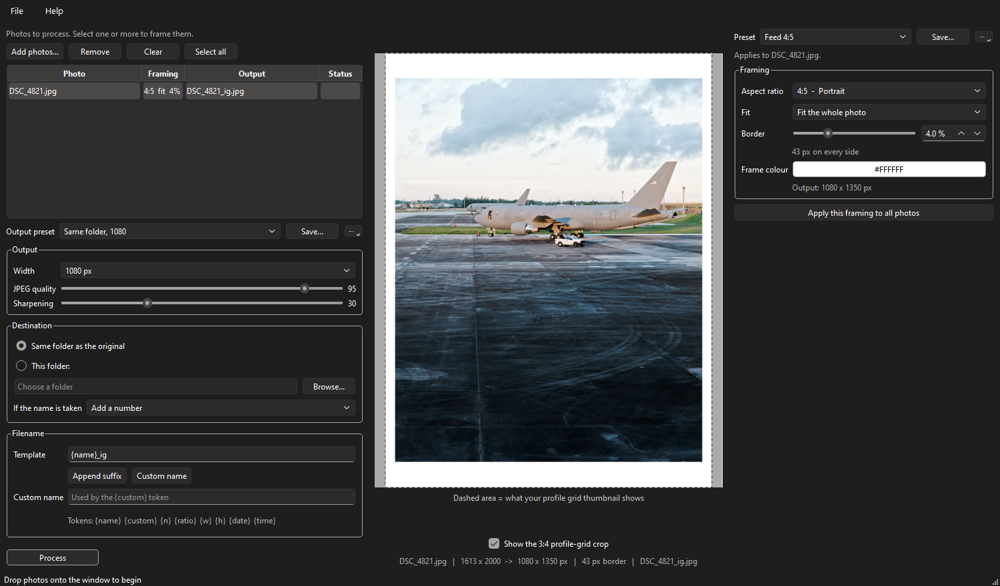

# IGprepper

[](https://github.com/JesseHaycraft/IGprepper/actions/workflows/tests.yml)

Prepare photos for Instagram: resize, frame, done.

Takes high-quality photos, resizes them to Instagram's native dimensions, adds a
consistent white frame, and writes upload-ready JPEGs. Batch, drag-and-drop,
with a live preview.



## Why not just export from Lightroom

Three things this does that a plain export does not:

- **Converts to sRGB.** Instagram assumes sRGB and does not reliably honour
  embedded ICC profiles, so an AdobeRGB or Display P3 export uploaded as-is
  comes out visibly flat. This is the single most common cause of "my colours
  died after uploading".
- **Downscales to 1080 itself, then sharpens.** Uploading a larger file means
  Instagram's servers downscale and recompress it for you, with no sharpening.
  Doing it locally with Lanczos plus a measured unsharp pass keeps the detail.
- **Encodes 4:4:4.** Instagram recompresses everything on upload. Handing it
  4:2:0 compounds colour-edge artifacts through a second generation of loss.

And it puts the *same* border on every photo, whatever the ratio, which is the
part that is annoying to do by hand.

## Windows

Download `IGprepper.exe` from the
[latest release](../../releases/latest) and double-click it. No Python needed.

## Ubuntu / Linux

Four commands from a fresh machine:

```bash
sudo apt install python3-venv libxcb-cursor0
git clone https://github.com/JesseHaycraft/IGprepper.git && cd IGprepper
python3 -m venv .venv && .venv/bin/pip install -r requirements.txt
.venv/bin/python -m igprep
```

`libxcb-cursor0` is the one system package Qt needs beyond Python; without it
the window fails to open and the app says so on startup.

To update later: `git pull`.

## macOS

As for Linux, without the `apt` line.

## Opening photos

Drop them on the window, use **Add photos...**, or pass them on the command
line — `python -m igprep photo.jpg`, which is also what "Open with" and a
Linux `.desktop` launcher use.

## Using it

Drop photos or folders onto the window, select one or more in the list, set
their framing on the right, press **Process**.

The window is divided by scope, so no setting appears twice:

- **Left** -- the photo list, and below it everything that applies to the whole
  run: output width, quality, sharpening, destination, filenames, and the
  **Process** button.
- **Middle** -- the preview of the selected photo.
- **Right** -- framing for the selected photo(s): ratio, fit, border, colour.
  *Apply this framing to all photos* copies it across the list.

The list is selection only; nothing in it is editable. Photos you add later
inherit whatever the framing panel is showing.

**Aspect ratios.** Instagram replaced its square profile grid with a ~3:4 one
in 2025, so 3:4 (1080 x 1440) is the default: it is the only ratio that renders
uncropped in both the feed and the profile grid.

| Ratio | At 1080 wide | Notes |
|---|---|---|
| 1:1 | 1080 x 1080 | Loses 135px per side in the grid |
| 4:5 | 1080 x 1350 | Tallest the feed shows; loses 33px per side in the grid |
| 3:4 | 1080 x 1440 | Default. Uncropped everywhere |
| 1.91:1 | 1080 x 566 | Widest allowed; heavily cropped in the grid |
| 9:16 | 1080 x 1920 | Stories and reels, not feed |

Turn on the grid overlay to see exactly what each ratio loses in the profile
grid. The dashed area is what the thumbnail keeps; everything dimmed is cut.

**Border.** Measured as a percentage of canvas *width*. Since every Instagram
canvas is the same width, a given percentage produces an identical pixel border
at every ratio, so portraits and landscapes look identically framed side by
side. The default 4% is 43px at 1080.

It is a per-photo setting, so consistency across your grid comes from leaving
it alone or using *Apply this framing to all photos* -- not from the tool
refusing to let you change it.

**Crop vs fit.** Per photo, set in the framing panel.

- *Fit* (default) scales the whole photo inside the frame and lets white fill
  the rest, so the mat goes uneven. Nothing is lost.
- *Crop* centre-crops to the target ratio and fills the frame. Uniform border,
  but you lose the edges.

**Presets.** Two separate lists, one per scope. *Preset* at the top of the
right panel saves framing — ratio, fit, border, colour — and applies it to the
selected photos. *Output preset* above the batch settings saves width, quality,
sharpening, destination and the filename template, and applies to the whole
run. Picking a preset you have already selected re-applies it, which is how you
discard edits; the list shows `(modified)` whenever the panel has drifted from
the saved values.

The custom name is never stored in a preset — it belongs to one batch.

**Width.** 1080 by default. 1440 is available, but organic uploads wider than
1080 get downscaled server-side, so it usually costs quality rather than adding
it.

**Filenames.** One template field, with presets for the two common cases.

| Token | Meaning |
|---|---|
| `{name}` | Original filename, without extension |
| `{custom}` | The custom name you type |
| `{n}` | Sequence number; pad it as `{n:03}` |
| `{ratio}` | Aspect ratio, e.g. `3x4` |
| `{w}` `{h}` | Output dimensions |
| `{date}` `{time}` | From EXIF capture time, falling back to file time |

The original is never overwritten, whatever the collision policy is set to.

## Building the Windows executable

```bash
pip install -r requirements-dev.txt
python build_exe.py
```

Produces `dist/IGprepper.exe` as a single file with no Python
installation required.

## Development

```bash
pip install -r requirements-dev.txt
pytest
```

The layout keeps the image pipeline free of any UI imports:

```
igprep/
  core/       pure pipeline, fully unit-tested
    geometry.py   canvas, border and crop maths
    color.py      ICC handling
    render.py     resize, sharpen, composite, encode
    naming.py     filename templating
    pipeline.py   ties a source file to a written output
    settings.py   persisted preferences
  gui/        PySide6 application
tests/
```

Processing order matters and is deliberate; it is documented in
[SPEC.md](SPEC.md).

The GUI tests run headless against Qt's offscreen platform, so `pytest` needs
no display.
